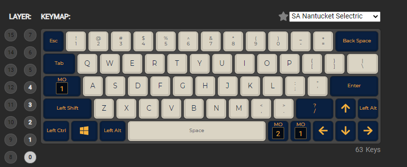
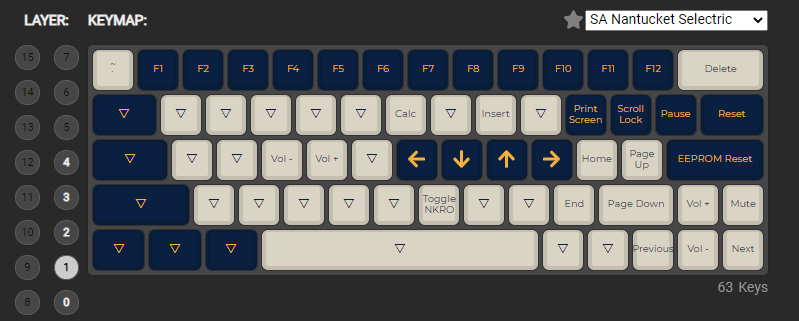
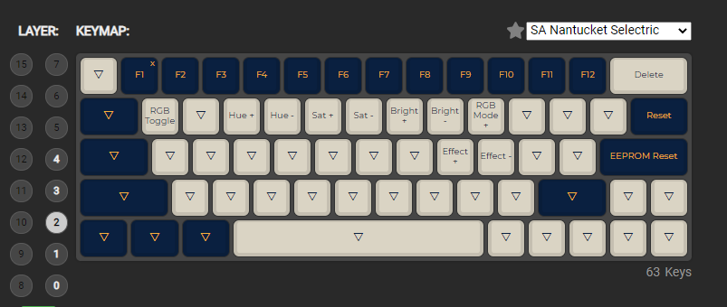

# DZ60RGB V2 PCB 

This is a guide and reference for updating the layout of the [DZ60RGB V2 Hot Swap PCB](https://kbdfans.com/collections/60/products/dz60rgb-hot-swap-custom-keyboard-pcb)

You would think there would be up to date information on how to do this in a single place, perhaps on the only website that's actually selling this PCB, but no. I had to scour the internet for forums of people troubleshooting this whole process. Now it is in a single place and I'll never have to do that again.

Also, this keyboard layout is the only correct layout. The instructions for how to create a new layout were included as a joke.

## Current Layout

This layout is available in the hex file included in this repo.

### Layer 0

### Layer 1

### Layer 2

## Instructions

### **Create a Layout**

Go to this website and create a layout:

https://config.qmk.fm/#/dztech/dz60rgb/v2/LAYOUT

Click 'Compile', and then the 'Download Firmware' button once it's done compiling.

### **Download and Install Software**

Install Microcontroller Driver

https://www.microchip.com/developmenttools/ProductDetails/flip

Download the QMK Toolbox

https://github.com/qmk/qmk_toolbox/releases

### **FLASH**

Open QMK Toolbox.

Select the hex file that you created earlier, and make sure 'atmega32u4' option is selected in the MCU dropdown menu.

Plug in the keyboard and reset it using one of these 2 methods:

- Press Fn + \
- Click the 'Reset' button under the PCB

The QMK Toolbox console should indicate that you've connected a new device.

Click 'Flash' in QMK Toolbox.

The keyboard should be functional after you get a 'device disconnected' message in the QMK Toolbox console. 
